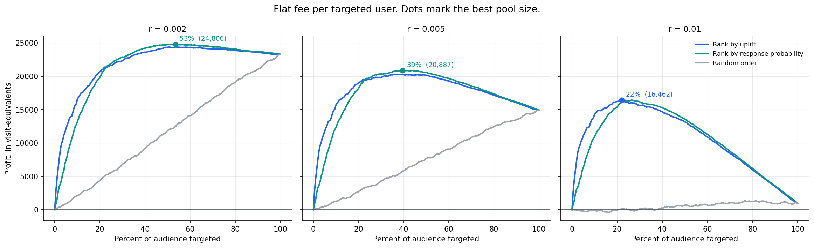
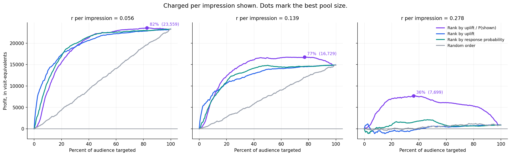

# Uplift Modeling and Targeting Policy

**Which users should an advertiser pay to reach, and does uplift modelling actually help you decide?**

Analysis of a 14 million row randomised advertising experiment released by Criteo. Three notebooks: data validation, uplift modelling, targeting policy and profit.

---

## The short version

| Finding | Evidence |
|---|---|
| Uplift ranking barely beats ranking by predicted response probability | Across five splits the winner changed sign at two of three cost levels. Uplift ranking won consistently only when cost was high enough to shrink the pool to a quarter of the audience, and won by 1.5% |
| The reason is that uplift here is mostly *reach*, not persuadability | Only 3.6% of targeted users are ever shown an ad. Both rankings end up sorting on browsing activity |
| Which means uplift ranking loads the expensive users in first | Under per-impression billing it becomes the **worst** of three strategies tested, behind even the naive one |
| Ranking by uplift per impression fixes it | Won all 15 seed-and-price comparisons, by 12% at moderate prices and 5.7x at high ones |
| Targeting at all is where most of the value sits | The top 5% of users deliver 43% of the campaign's entire effect. At high cost, advertising to everyone is worth 958 incremental visits; targeting the top quarter is worth 16,677 |
| No users were detectably pushed away by the campaign | Tested against a noise floor measured beforehand, rather than asserted |

The headline is a negative result about the technique the project was built to showcase. It leads because the explanation for it is what makes the second half work.

---

## The question

An ad campaign raised site visits from 3.820% to 4.854%, a lift of 27%. That is a real effect, and it does not mean the ad should have been sent to everyone.

Some users would have visited anyway. Advertising to them costs money and changes nothing. Some are genuinely moved. A few might be annoyed and pushed away.

> Given a budget that covers only part of the audience, which users should receive the ad, and does ranking by predicted uplift beat ranking by predicted response probability or sending to everyone?

**Uplift** is the change in a user's behaviour caused by the ad. It can never be observed for an individual, because each person either sees the ad or does not, never both. So it is estimated across groups and evaluated by ranking.

---

## The data

Criteo Uplift Prediction dataset v2.1, a real randomised experiment. Users were assigned by chance before any ad was served: 85% eligible to be shown the campaign, 15% blocked from it.

| | Treated | Control |
|---|---|---|
| Users | 11,882,655 | 2,096,937 |
| Visit rate | 4.854% | 3.820% |
| Conversion rate | 0.3089% | 0.1938% |

| Outcome | Absolute lift | 95% interval | Relative | z |
|---|---|---|---|---|
| Visit | +1.034pp | 1.006 to 1.063pp | +27.07% | 70.7 |
| Conversion | +0.115pp | 0.109 to 0.122pp | +59.45% | 33.5 |

Twelve features, anonymised with no published meaning. Not downloadable from this repo; see [Reproducing](#reproducing).

### The column that looks useful and is not

`exposure` records whether an ad was actually served. Only 428,212 of 11,882,655 eligible users, or **3.6%**, were ever shown one. Eligibility is a permission; being shown an ad also requires the user to come back and browse.

It is tempting to compare exposed users against the control arm. That comparison is wrong, and this dataset shows why in one table:

| Group | Users | Visit rate |
|---|---|---|
| Shown an ad | 428,212 | 41.454% |
| Eligible, never shown an ad | 11,454,443 | 3.486% |
| Control arm | 2,096,937 | 3.820% |

Exposed minus control gives 37.6 percentage points. The correct figure is 1.03. The naive comparison overstates the effect **36 times**.

The mechanism is visible in the same table. Users who were eligible but never shown an ad received no advertising, exactly like the control arm, and they visit at a *lower* rate. The ad did not make them visit less. Removing the heavy browsers from the treated arm left a less active remainder. Exposure is caused by user behaviour, so exposed users are a self-selected population who visit more often regardless.

Every comparison here is **intent to treat**: users are compared by the arm they were assigned to, whatever happened afterwards. `exposure` never enters a feature set. It reappears in notebook 3 only as an observed cost driver, which is a different role.

---

## Findings

### 1. Uplift ranking's advantage is small and conditional

Two rankings, both from the same model:

- **Uplift ranking** puts first the users the ad changes most
- **Response ranking** puts first the users most likely to visit, ad or no ad

Response ranking is the naive baseline the whole exercise is meant to beat.

Five splits, three cost levels. Cost is expressed as a ratio `r`, the cost of targeting one user divided by the value of one visit, so profit is measured in visits and no currency is invented.

| r | Best pool | Response minus uplift, mean | Sd across splits | Splits response won |
|---|---|---|---|---|
| 0.002 | 55% | +65 | 234 | 2 of 5 |
| 0.005 | 40% | +114 | 303 | 3 of 5 |
| 0.010 | 25% | −242 | 222 | 0 of 5 |

At the two cheaper prices the winner depends on which random split you use. That is not a result.

At the highest price uplift ranking won all five, by 242 visit-equivalents out of 16,677. Consistent, and worth 1.5%.

The pattern is explained by where the two curves cross. Uplift ranking is ahead in roughly the top 22% of the list and behind through the middle. Higher cost means a smaller pool, which lands in uplift ranking's territory.



Profit against how much of the audience you target, at three cost levels. The dot marks the best pool size. Blue and green sit almost on top of each other, and which one is ahead depends on where the peak falls. The peak slides from 53% to 22% as targeting gets more expensive.

> A single split gave "response ranking wins by 394 and 579". Both claims dissolved under repetition, and the third claim, which had looked like a 21-visit tie, is the one that survived.

### 2. Why the two rankings agree so much

Since only 3.6% of targeted users ever see an ad, and that probability varies enormously between users:

```
uplift(x)  ≈  P(shown an ad | x)  ×  effect if shown
```

The first term dominates. And what drives the chance of being shown an ad is browsing activity, which is also what drives the chance of visiting anyway.

Both rankings end up sorting largely on the same underlying thing. That is a fact about this dataset rather than a modelling failure, and it is confirmed directly: a model predicting `exposure` from the twelve features reaches an AUC of **0.9222** on held-out rows.

### 3. Under per-impression billing, the standard approach collapses

If the advertiser is billed per ad shown rather than per name targeted, cost stops being flat. High-uplift users are exactly the users who see the most ads, so they are also the most expensive.

Ranking by uplift therefore buys the expensive users first, and has nothing cheap left to trim. Its optimal pool stayed at 99.5% of the audience across almost the entire price range.

The fix is to rank by effect per ad actually paid for:

```
uplift(x) ÷ P(shown an ad | x)
```

| Price per impression | Rank by uplift | Rank by response | Rank by uplift ÷ P(shown) |
|---|---|---|---|
| 0.056 | 23,410 | 23,296 | **23,761** |
| 0.139 | 15,088 | 14,942 | **16,828** |
| 0.278 | 1,418 | 2,126 | **8,065** |

Fifteen out of fifteen seed-and-price comparisons won by the adjusted ranking. At the highest price the worst of five splits still beat plain uplift ranking by 6,320, which is 24 standard deviations from zero.

Read the bottom row. Plain uplift ranking finishes **behind the naive response ranking**, and the adjusted ranking makes 5.7 times its profit.



The same three advertisers billed per impression rather than per targeted user. Purple is the cost-adjusted ranking. In the right-hand panel, blue (plain uplift ranking) sits below the random line for most of the range while purple peaks at 7,699.

The crossover price varies by split. In two of five, the adjusted ranking was already ahead at the lowest price scanned; in the other three it overtook at 0.015 to 0.045. Above 0.056 it wins every time. A single split would have reported one confident number instead of a range.

### 4. Targeting at all is most of the value

| Pool | Users | Incremental visits | Share of total | Break-even r |
|---|---|---|---|---|
| Top 5% | 139,795 | 12,475 | 43% | 0.0892 |
| Top 20% | 559,183 | 21,832 | 76% | 0.0390 |
| Top 50% | 1,397,959 | 27,161 | 94% | 0.0194 |
| Everyone | 2,795,919 | 28,917 | 100% | 0.0103 |

Five percent of the audience carries 43% of the campaign's whole effect. The bottom half carries 6%.

Against sending to everyone:

| r | Best targeted strategy | Send to everyone | Advantage |
|---|---|---|---|
| 0.002 | 24,924 | 23,325 | +7% |
| 0.005 | 20,922 | 14,937 | +40% |
| 0.010 | 16,677 | 958 | +1,640% |

The break-even column works out as the average uplift of the users in that pool, which is what makes it interpretable rather than arbitrary.

### 5. No sleeping dogs

Users made *less* likely to visit by being advertised to would be free profit to exclude. Ten groups by predicted uplift, each with a confidence interval, tested against a noise floor measured in notebook 1.

None qualified. Every group showed positive uplift and none had an interval sitting below zero.

The model does separate users, decisively:

| | Value |
|---|---|
| Top group's uplift | 0.0612 |
| Bottom group's uplift | 0.0007 |
| Spread | 0.0605 |
| Spread produced by random grouping | 0.0039 |
| Ratio | 15x |

One row is worth pulling out, because finding 1 raises a fair question about whether the model is really doing uplift at all:

| Group | Treated visit rate | Control visit rate | Uplift |
|---|---|---|---|
| 8 | 0.133% | 0.120% | 0.00013 |
| 9 | 0.110% | 0.078% | 0.00032 |
| **10** | **2.154%** | **2.088%** | **0.00067** |

Group 10 visits twenty times more often than the groups above it, and the ad still does nothing for them. These are the sure things, and the model placed them **last**. Response ranking would have put them near the top.

---

## How it was done

### Validation before modelling

Notebook 1 produces no model. It establishes what the data can support.

**Which outcome is modellable.** Conversion has a bigger relative lift, 59% against 27%, and only 4,063 events in the control arm. Split into 50 groups, that is 81 events per group against a 0.115pp difference to detect. Visit has 80,105. Visit is modelled; conversion is reported with its instability stated.

**How much apparent effect the data produces from nothing.** Assign users to bins at random, so the true uplift in every bin is identical, then measure uplift anyway. The spread is pure noise, and it is the bar any model must clear.

| Outcome | Bins | Noise sd | Widest fake gap, as share of the real effect |
|---|---|---|---|
| Visit | 20 | 0.065pp | 21% |
| Conversion | 50 | 0.025pp | 100% |

At 50 bins on conversion, random grouping alone produces a best-to-worst gap equal to the entire average treatment effect. Every evaluation curve in this project is therefore drawn against a band built from random rankings.

The same exercise checks whether standard errors are trustworthy. Observed spread matched the independent-rows prediction at every bin count, ratios 0.93 to 1.08, so the confidence intervals above are honest.

**Whether the experiment is actually valid.** All twelve covariate imbalances sit below 0.05, passing the usual 0.1 convention. Rather than stopping there, the treatment labels were permuted 50 times to build the distribution random assignment actually produces:

| | Value |
|---|---|
| Observed largest imbalance | 0.0488 |
| Largest produced by 50 random redeals | 0.0028 |
| Permutation p-value | 0.000 |

So the imbalance is real, not chance, and every feature exceeds its own null. A propensity model then bounds how much it matters: **AUC 0.50909 against a permuted null of 0.4997**, meaning the two arms are distinguishable by 0.9 percentage points over a coin flip. Propensity scores span 0.842 to 0.896 for 98% of users, with both arms present at the extremes, so common support holds and uplift is measurable everywhere.

Significance and magnitude point opposite ways here, which is the point of measuring both.

### Modelling

Three-part split, 60/20/20, stratified on the combination of arm and outcome so all three parts keep the same 85/15 ratio and the same 4.6992% event rate. Validation exists so that early stopping and calibration never touch the test set.

Two estimators, failing in opposite directions:

| | Approach | Weakness |
|---|---|---|
| T-learner | One model per arm, subtract | The control model trains on 15% of rows, and the target is a 0.010 difference between two numbers near 0.04 |
| S-learner | One model, treatment as a feature, predict twice | Nothing forces it to use the treatment input |

The S-learner used the treatment feature for 519 of 30,938 splits, or 1.68% against a uniform share of 7.69%. It under-used it, and still won:

| Estimator | Qini, mean of 5 seeds | Sd |
|---|---|---|
| S-learner, raw | **9,055** | 189 |
| T-learner, raw | 8,492 | 221 |

Five of five paired splits, mean advantage 563. Every estimator beat the random-ranking null by 22 to 29 times, winning all 50 random comparisons in all 20 combinations.

**Calibration was tested and dropped.** Isotonic regression, fitted per arm on validation rows. It can change an uplift ranking even though each correction preserves order on its own, because the two arms receive different corrections.

| | Treated model | Control model |
|---|---|---|
| Mean absolute error, raw | 0.000278 (0.57% of base rate) | 0.000761 (1.99%) |
| After calibration | 0.000346 | 0.000626 |

The models were already calibrated, because LightGBM's binary objective minimises log loss, which is a proper scoring rule, and no class rebalancing was applied. Calibration produced no reliable level improvement, no reliable ranking change, and roughly doubled seed-to-seed variance. Dropped, with the evidence shown.

### Evaluation

Qini curves throughout, each drawn against a band from 50 random rankings. Score ties broken at random rather than by row order, so a collapsed estimator cannot produce a spurious curve from the file's own ordering.

Everything in notebook 3 was repeated across five splits, with rankings compared **within** each split so the split's own luck cancels. That repetition reversed one headline claim and dissolved two others.

---

## Repository

```
Code/
    01_data_check.ipynb        Validation, noise floor, experiment integrity
    02_uplift_models.ipynb     Two estimators, calibration, Qini evaluation
    03_targeting_policy.ipynb  Targeting rules, profit, sleeping dogs
figures/                       Charts used in this README
Data/                          Not in the repo. See below
requirements.txt
```

Each notebook is standalone and loads the data itself. They read as a sequence, and each header states what it inherits from the one before.

---

## What I would flag if you were checking my work

1. Predicted uplift is shrunk by about 30%, averaging 0.007293 against a true average treatment effect of 0.010342, because the S-learner under-used the treatment feature. Rankings are unaffected, but the numbers should not be quoted as individual uplift estimates.

2. The experiment is not textbook clean. Permutation testing put the covariate imbalance at p = 0.000 with all twelve features beyond their null, and the two candidate explanations, coarser-than-row randomisation or features measured during the campaign, cannot be separated with anonymised features. The propensity AUC of 0.509 caps how much either can matter.

3. The T-learner's control model carries 1.99% relative level error against the treated model's 0.57%, because it trains on a fifth of the data. Uplift is around 0.010, so that error is 7.6% of the quantity being estimated, and it is why the S-learner wins.

4. Costs are a ratio, not a currency. The three levels bracket the average uplift of 0.0103, which is where the decision is interesting; nothing here asserts a real advertiser's economics.

5. Dividing by exposure probability was tested for stability. A floor of 0.005 was applied and then removed after it proved to sit above the median predicted exposure and to perform worse on held-out data at every level tried; the final guard of 1e-06 is reached by zero users, and the sensitivity test remains in notebook 3.

---

## Reproducing

```bash
pip install -r requirements.txt
mkdir Data && cd Data
curl -O http://go.criteo.net/criteo-research-uplift-v2.1.csv.gz
```

| | |
|---|---|
| File | `criteo-uplift-v2.1.csv.gz`, 311,422,618 bytes |
| sha256 | `2716e1bf0fd157a93b5bf86924d9088419dfbac2022c6cd90030220634f616dc` |
| Rows | 13,979,592 |
| LightGBM | pinned to 4.6.0, since 4.7.0 changes results silently |

Two versions circulate under the same name. Version 1 has 25,309,483 rows. This project uses **v2.1**.

Notebooks 2 and 3 have a `DEV_MODE` flag that runs everything on a 20% sample in a few minutes for checking the pipeline. All reported numbers come from full runs. Full runtimes are roughly 3 minutes, 90 minutes and 50 minutes.

Dataset citation: Diemert, Betlei, Renaudin and Amini, *A Large Scale Benchmark for Uplift Modeling*, AdKDD 2018 workshop at KDD.
